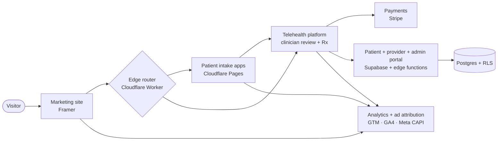

# Hi, I'm Hien 👋

### Technical Account Manager · Solutions Engineer · AI-Native Builder

I've spent about 10 years in fintech, payments, and SaaS as the technical person on enterprise accounts, first as a solutions engineer and later running technical account management. Over that stretch I launched 20+ API integration partnerships and wrote the specs behind them, kept a 98% retention rate on the accounts I owned, and had a hand in several million dollars of new business. I'm the person who's comfortable sitting in an executive review in the morning and heads-down on a broken integration by the afternoon.

Late in 2024 I stepped back from full-time work to be around for my son. I didn't sit still. I taught myself to ship real software by directing AI coding tools, and I used that to build and launch an actual product. He starts preschool this fall, so I'm ready to head back to full-time work with a lot more technical range than I had when I left.

## FORTE Health, the thing I built

[fortehealth.co](https://fortehealth.co) is a telehealth company I started and took all the way to a live, LegitScript-certified product, mostly on my own. I owned all of it: the brand, the marketing site, the patient intake, the portal with its provider and admin tools, Stripe billing, the compliance program, and the analytics and ad-tracking setup my marketing partner runs on now.

I'll be straight about how I built it, since it comes up in technical interviews. I didn't hand-write the production code. I wrote detailed specs, pointed Claude Code at them, and read every line that shipped. The architecture, the roadmap, and the build-or-buy calls were mine. It's honestly the same job I did as a solutions engineer, just closer to the keyboard: get up to speed on a new domain quickly and make a pile of separate systems behave like one product, this time with real healthcare compliance rules to stay inside of.

Today it's a working funnel end to end, from the marketing site through the questionnaire, clinician review, prescription, payment, and shipment tracking. I didn't treat compliance as an afterthought either. I built the HIPAA program (risk assessment, BAAs, policies) in from the start, and I ran a security audit of the backend before turning on any paid traffic.

## How it fits together

*This is the high-level shape. The code itself is private since it's a live healthcare app, but I'm glad to walk through it.*

Under the hood: Cloudflare (Workers, Pages, DNS, edge rules), Supabase and Postgres with row-level security and edge functions, Stripe, a telehealth engine, Framer, and a GTM / GA4 / Meta Conversions API tracking pipeline.

## A paid client build, same method

[JadeCow Creamery](https://jadecowcreamery.com) hired me to build their website and a custom CRM the same way. The CRM pulls in their point-of-sale data, cleans it up, ties it to their customer list and email signups, and tracks promo codes, campaigns, and what each customer spends. Different world from telehealth, real client, real deadline, and the approach held up.

## How I work

Hand me a messy problem and not much runway and I'm happy. I get to know the domain, figure out the one or two things that actually move the needle, build the smallest version that works, and then make it solid. I care about shipping, and I care about whoever ends up using the thing. That second part comes straight from ten years of pre-sales and account management.

Day to day I lean on Claude Code and Cursor to build, ChatGPT and Perplexity to research and think through problems, Gumloop for automation, and Higgsfield and Claude for design, plus Figma, Framer, and Supabase.

## Before this

- **Toast**, Senior Solutions Engineer. Ran the technical sale and delivery for a national brand's move off legacy Micros, a 16-month phased rollout with no disruption, and built out 20+ third-party API integrations, writing the specs and running the developer enablement behind them.
- **Otter**, Technical Account Manager. Took a near-churn enterprise client with 1,700+ storefronts from a 75% integration success rate to 98% in two quarters. The real fix was a missing change-management process, so I built the SOP and monitoring and we landed a three-year renewal.
- **Docusign**, Technical Customer Success Manager. Owned post-sale for enterprise financial-services accounts and caught integration problems with API and SQL analysis before customers ran into them.

Full history is on LinkedIn.

## Find me

- 🌐 My product: [fortehealth.co](https://fortehealth.co)
- 🍦 Client build: [jadecowcreamery.com](https://jadecowcreamery.com)
- 💼 LinkedIn: [in/hnguyen05](https://www.linkedin.com/in/hnguyen05/)
- 📫 hien.nguyen.work86@gmail.com

I'm looking for Forward-Deployed Engineer, Solutions Engineering, and technical product roles, remote in the US.
